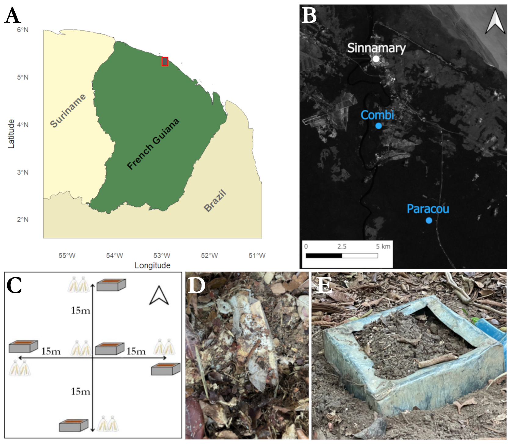

```{r DoNotModify, include=FALSE}
### Utilities. Do not modify.
# Installation of packages if necessary
InstallPackages <- function(Packages) {
  InstallPackage <- function(Package) {
    if (!Package %in% installed.packages()[, 1]) {
      install.packages(Package, repos="https://cran.rstudio.com/")
    }
  }
  invisible(sapply(Packages, InstallPackage))
}

# Basic packages
InstallPackages(c("bookdown", "formatR", "kableExtra", "ragg"))
library("kableExtra") # Mandatory to load css and more

# Chunk font size hook: allows size='small' or any valid Latex font size in chunk options
def.chunk.hook  <- knitr::knit_hooks$get("chunk")
knitr::knit_hooks$set(chunk = function(x, options) {
  x <- def.chunk.hook(x, options)
  ifelse(options$size != "normalsize", paste0("\n \\", options$size,"\n\n", x, "\n\n \\normalsize"), x)
})
```

```{r Options, include=FALSE}
### Customized options for this document
# Add necessary packages here
Packages <- c( "tidyverse")
# Install them
InstallPackages(Packages)

# knitr options
knitr::opts_chunk$set(
  cache=FALSE, # Cache chunk results
  echo = TRUE, # Show R chunks
  warning=FALSE, # Hide warnings
  # Books only: figures with side captions
  # fig.env='SCfigure', fig.asp=.75,
  # Figure alignment and size
  fig.align='center', out.width='80%',
  # Graphic device
  dev = "ragg_png",
  # Code chunk format
  tidy=TRUE, tidy.opts=list(blank=FALSE, width.cutoff=50),
  size="scriptsize", knitr.graphics.auto_pdf = TRUE
  )
options(width=50)

# ggplot style
library("tidyverse")
theme_set(theme_bw())
theme_update(panel.background=element_rect(fill="transparent", colour=NA),
             plot.background=element_rect(fill="transparent", colour=NA))
knitr::opts_chunk$set(dev.args=list(bg="transparent"))

# Random seed
set.seed(76)
```


```{r, echo=FALSE, message=FALSE, warning=FALSE, fig.show='hide', results='hide'}
# running the analyses, from which we will import plots and stats:

# to uncomment for the last submission
 source("analysis/cleaning.data.R")
 source("analysis/statistical.analysis.R")
```


# Introduction

The soil is the single most diverse habitat on Earth, being home to 59% of all species, from microbes to mammals [@anthony_enumerating_2023]. Key ecosystem functions, such as nutrient cycling, water storage or biomass production, depend directly on soil biodiversity [@brussaard_soil_2012;@safaei_assessing_2019]. However, biodiversity is decreasing at an unprecedented rate because of increasing anthropic pressures: humans degrade soils both at the chemical, physical and biological level [@jose_agroforestry_2012;@ferreira_soil_2022]. One of the anthropic activities that has a strong impact on soil biodiversity is agriculture. Intense agricultural practices negatively impact the diversity and abundance of soil species [@bedolla-rivera_analyzing_2023]. Recent studies have shown the long recovery rates of soils degraded by agriculture, with recoveries ranging from only a few years [@DOJANI2011263] to millennia under hyper arid conditions [@Weber2016]. 

To reduce agriculture negative impacts on soil, extensive practices such as agroecology, have seen growing interest. Agroecology refers to the study of ecological processes to apply it to agricultural production systems. The application of the agroecological approach to forest and tree crop production is agroforestry. Agroforestry integrates trees into crop systems where at least two plant species interact biologically, one of the plant species is a woody perennial, and one is managed for forage, annual or perennial crop production [@somarriba_revisiting_1992].

In the tropics, deforestation is leading to the extension of areas with unsustainable land use [@lamb_restoration_2005], and agroforestry systems represent some of the most promising approaches to best respond to local population needs and biodiversity management [@bhagwat_agroforestry_2008; @decaens_biodiversity_2018; @gardner_prospects_2009; @garrity_agroforestry_2004]. Agroforestry is thus expected to preserve soil biodiversity. Trees, as engineer species, improve soil structure and fertility, create microhabitats, enhance water infiltration, increase the availability of organic matter and stimulate biological activity by creating local concentrations of organic resources from litter production [@marsden_how_2020; @udawatta_agroforestry_2019]. Furthermore, tree canopies moderate temperature variations, with lower maxima due to radiation interception, higher minima due to shelter effects, and a lower average temperature [@CHEN199999].

The Cocoa tree *Theobroma cacao* L.), as a commercially valuable tropical understory species, is one of the crops most commonly grown under shade trees in tropical agroforestry systems [@franzen_ecological_2007]. Those agroforestry systems vary from cacao grown under thinned natural forest canopy, to cacao grown under only one species for shading  [@moco_relationships_2010]. Trees used for shading can relate to the diversification of farm products, and to the increase of soil fertility [@sauvadet_shade_2019]. In the Amazon, *Erythrina* or *Inga* species are frequently used as shade trees to improve soil fertility for their biomass production and N-fixation characteristics [@lojka_biomass_2005].

Although the capacity of agroforestry systems to sustain above ground diversity is well studied, research remains to be done on the impact of agroforestry on soil diversity [@marsden_how_2020;@moco_relationships_2010]. Mechanisms driving soil diversity are still not clear, as well as the links between above ground and below ground diversity [@marsden_how_2020;@moco_relationships_2010]. Consequently, studying soil communities associated with agroforestry, such as cocoa agroforestry systems, is of interest. 

To study soil biodiversity, focusing on soil macrofauna is a good start. Macrofauna organisms easy to observe and to quantify in the field. It performs most of the organic matter fragmentation, soil bioturbation and regulation of microbial activity [@lavelle_soil_2006;@potapov_feeding_2022]. In general, the soil fauna plays important roles in all of the functions that determine soil health, such as organic matter decomposition, nutrient cycles, soil structure and the regulation of pathogens [@kibblewhite_soil_2008]. Moreover, inferences can be made at the community scale from soil macrofauna organisms, by reconstructing food webs and classifying fauna in functional groups [@potapov_feeding_2022]. Macrofauna usually refers to fauna greater than 2 mm [@decaens_macroecological_2010]. Alternative definitions gather all visible fauna, greater than 0.5 mm. We will henceforth refer to the latter definition when using the term macrofauna. 


Factors that can explain the huge fauna diversity in soil involve niche partitioning, notably through the diversity and the amount of food resources [@Anderson1975;@potapov_feeding_2022]. Many studies related soil fauna diversity to litter traits [@moco_relationships_2010;@laossi_effects_2008], which are directly influenced by tree species of a habitat [@korboulewsky_how_2016;@rousseau_shade_2021]. However, there can be a high diversity of soil food resources without a high diversity of agroforestry associated trees. In cocoa-based agroforestry systems, the effect of shade tree identity and functional group on soil macrofauna appears to be dominant over the effect of shade tree diversity [@laossi_effects_2008;@rousseau_shade_2021;@wardle_influence_2006]. The presence of *Inga* species in the system seems to influence soil macrofauna [@rousseau_shade_2021], probably because of its N-fixation capacity [@blanchart_long-term_2006;@kaspari_biogeochemistry_2009;@rousseau_shade_2021;@velasquez_soil_2012]. However, the influence of agroforestry shade tree identity on communities can vary with the plantation management and fertilisation [@sauvadet_shade_2019].

In French Guiana, the C2G2 project is a recent example of experimental tropical cocoa plantations in agroforestry that includes shade trees [@saj_projetc2g2_2023]. One of the C2G2 project plantation is based in the Combi station, Sinnamary, where cocoa trees are intercropped with *Inga*. This agroforestry system aims at increasing plantation resilience, and reducing impacts on the environment. A previous study in species diverse forests has found beneficial effect of cocoa agroforestry plantation on soil fauna communities [@da_silva_moco_soil_2009]. As a species-poor plantations with monospecific shade trees, Combi plantations could affect fauna communities differently.

In the present research, we therefore examined the following question: how do soil macrofauna communities differ between the Combi cocoa agroforestry plantation, and a species-rich natural undisturbed forest? Comparing the Combi cocoa plantation with a nearby tropical coastal rainforest, we tested the hypothesis that the differences in quantity and in diversity of organic matter between these two sites has cascading effects on soil macrofauna, and induces differences in soil communities. We carried out the Tropical Soil Biodiversity and Fertility (TSBF) method and wood decomposition assessments to test three predictions. First, that there is a higher abundance of macrofauna in the agroforestry plots because of fertilisation, and a higher leaf litter production. Second, that the much greater tree diversity in the secondary forest separates resources into more niches, leading to a higher overall alpha diversity of soil macrofauna, and differences in beta-diversity between agroforestry and forest soil communities. Third, that xylophagous and saprophagous taxa are mostly found and more active in the forest because of a higher prevalence of dead wood. 

# Methods

## Study sites
To compare soil macrofauna communities of the Combi cocoa plantations with a natural undisturbed tropical forest, we selected a natural forest site at a maximum distance of 10 km of Combi, in the municipality of Sinnamary, French Guiana (Figure 1B). We assumed that climatic conditions did not change at this distance.  

The natural forest site is located in the Paracou experimental research station, first set up in 1984 in a stand of coastal rainforest to study the effects of logging. We selected plot number 6 (250x250 m), which is a control plot. In this plot, no logging has occurred, and the soil has not been amended with fertilisers. Our sample area is located close to the path in a slope facing NNE and leading to a flat area. 

In the Combi station, agroforestry cocoa plantations have been set up in 2018. The plantation site consisted in a flat area, which were originally savannas. Cocoa plantations consisted of clonal crops, and of propagated crops left for free cross-pollination. In the station, two plots of clonal cocoa trees and one plot of free-pollinating trees were intercropped under established *Inga edulis* trees [@saj_projetc2g2_2023]. An additional plot of free-pollinating trees was planted under banana trees, which were later replaced by *Inga* trees, resulting in a total of four cocoa-Inga plots. In the past, these plots have been provided with water and nutrients, and the soil amended with lime to counteract the acidic soil typical of French Guiana.  

## Experimental setup

### Soil mesofauna activity in wood decomposition

In order to assess wood decomposer activity in the two habitats, we measured the decomposition rates of 110x15x2 mm tongue depressors made from unidentified, non-native, untreated wood. To differentiate between mesofaunal and microbial soil activity on decomposition, we placed tongue depressors in mesh bags, which we then left buried under leaf litter. Two types of mesh bags were used, with either a tight-mesh allowing the passage of microbes only (0.05 mm holes), or a wide-mesh allowing passage of microbes and mesofauna (0.4 mm holes). After 68 days, the tongue depressors were collected, oven dried for 48 hours at 60°C and weighted. We calculated a proxy of soil activity from the difference between the initial and final tongue depressors’ weights. The weight loss of the tight-mesh bags was subtracted from the weight loss of the wide-mesh bags to estimate mesofaunal activity.  

The same protocol was carried out at both the Paracou and Combi sites. Pairs of mesh bags (one wide-mesh, one tight-mesh) each containing two depressors, were buried under leaf litter in a cross pattern. Four pairs of bags surrounded a central pair of bags at a distance of 15 m, at each of the four cardinal points (Figure \@ref(fig:method)). We repeated this cross-pattern design in two locations at each site. At the Combi site, we repeated this design at the centre of the two biggest cocoa-Inga sub-plantations. At the Paracou site, we chose two accessible locations from the forest path in plot number 6, maintaining the same distance between the two locations than in the Combi site for consistency.    

### Soil macrofauna diversity and abundances

We adapted the Tropical Soil Biodiversity and Fertility (TSBF) method to assess soil biodiversity and fertility in the agroforestry and forest plots [@anderson_tropical_1989]. The TSBF method is commonly used to study the diversity and abundance of soil macrofauna. A standardised sampling method, it permits soil biodiversity comparison between different communities. We collected visible fauna in 25 by 25 cm quadrats in three different soil layers: the leaf litter, the first 10 cm of soil, and soil at 10-20 cm depth. We decided to exclude soil at 20-30 cm depth, usually included in TSBF sampling, as it contains a negligible amount of macrofauna diversity and abundance. We conducted the TSBF method at both the Paracou and Combi sites in the same areas used to bury tongue depressors. The TSBF assessments were carried out at approximately 30 cm of the bag burial sites, but in only one of the locations at both the Combi and Paracou stations because of the labour-intensive nature of the TSBF method. In Combi, we selected the most accessible of the two subplots, and in Paracou, the location with the least roots to facilitate soil sampling. We then characterised the organisms we sampled at the order level, as it simplifies their identification while retaining information about macrofauna trophic levels and functional groups [following, @decaens_identification_2015].

## Statistical analyses
We carried out all of our analyses using R (v4.4.1). We used packages lmtest (v0.9-40) to test for linear model assumptions, FactoMineR (v2.11) and factoextra (v1.0.7) for Correspondence Analyses (CA) and their visualisation, vegan (v2.6-8) and ape (v5.8) for Principal Component Analyses (PCoA) on Bray-Curtis distances, and entropart (v1.6-15) for diversity profiles and analyses. 

### Differences in macrofauna abundances
We tested whether the abundance of each taxon sampled by the TSBF method was greater in the Combi or the forest site. We combined taxa abundances from the three soil layers (leaf litter, first 10 cm, and 10 to 20 cm depth) into overall soil profiles, and attempted to test for abundance differences of taxa sampled at least 10 times using Analyses of Variance (ANOVAs). As the residual error was non-normal for many orders, we evaluated differences using Wilcoxon rank-Sum tests.  

### Macrofauna diversity
To explore taxa alpha diversity at both sites, we calculated diversity profiles for orders of diversity ranging from 0 to 4 of the three soils layers communities, and of the combined-soil-layers community [“entropart” R package, @marcon_entropart_2015]. To compare diversity profiles between the two sites, we estimated 95% confidence intervals by drawing 500 hypothetical communities from observed frequencies, from which we estimated new diversity measures. Intervals were then estimated by the 2.5% and 97.5% quantiles. We explored the completeness of our sampling with order accumulations curves (“specaccum” R function, see Figure \@ref(fig:accumcurve)).  

 To test whether community compositions differed between agroforestry and forest sites, we studied Bray-Curtis dissimilarities between soil samples. We chose the Bray-Curtis index as it is sensitive to both the presence/absence of taxa, and to their relative abundances. For each TSBF digging sites, we combined taxa abundances from the three soil layers, and estimated the Bray-Curtis dissimilarity matrix between these profiles. We transformed Bray-Curtis dissimilarities into metrics by calculating their square-roots, and verified that it did not distort our data using a Pearson correlation between the non-transformed, and the square-rooted matrix. We performed a PCoA on the square-rooted matrix to explore relative dissimilarities between soil sample communities. The clustering of forest and agroforestry samples from these dissimilarities was further tested by a permutation multivariate ANOVA [PERMANOVA,@kenett_permutational_2017], with sites as factor. Since PERMANOVAs are sensitive to both group locations and dispersion in the multivariate space, we checked for overdispersion using a permutation analysis of multivariate dispersion [PERMDISP,@anderson_distancebased_2006]. 

### Trophic preferences 

We associated to each order one or more of the following trophic preferences: phytophagous, saprophagous, rhizophagous, xylophagous, and predator [@decaens_identification_2015; @potapov_feeding_2022]. We then computed the abundance of macrofauna in these trophic groups for each TSBF samples. We assumed that an individual had only one trophic preference. Consequently, when an order was associated with more than one trophic group, we split its abundance equally between the groups. We then analysed associations between trophic preferences, and either the agroforestry site, or forest site using a Correspondence Analysis (CA). 

To further assess the greater prevalence of xylophages in the forest, we estimated a proxy of mesofaunal activity on wood decomposition by subtracting the weight loss of the tight-mesh bags from the weight loss of the wide-mesh bags. As tongue depressors had different initial weights, measures were standardised as proportions of the initial weights. We attempted to fit a linear model with sites as the explanatory variable and the differences of weight losses between tight-mesh and wide-mesh bags as the response variable. However, as the assumption of the normality of the residual error was breached, we evaluated differences in decomposition between wide-mesh and tight-mesh bags using a Wilcoxon Rank-Sum test. 

# Results

## Differences in macrofaunal abundances 


```{r abundance, echo=FALSE, fig.cap="Abundances of macrofauna orders in the forest and in the agroforestry cocoa plantation. \\textit{Taxa orders are arranged from most (Isoptera) to least sampled. Only isopods, collembolas and blattopteras differed in abundance between the two sites, and were mostly found in the cocoa plantation. Wilcoxon rank-Sum tests significative at the alpha risk of 5% are indicated by a *.  Refer to Table S1 for the signification of the order code names.}", fig.env= "figure*", out.extra="",dpi=200 }
plot(finalTSBFabundanceplot)

```

We sampled 646 soil macrofauna organisms from 23 orders at the Combi site, and 589 organisms from 24 orders at the natural forest site, resulting in a total of 1,235 individuals from 29 orders at both sites (Figure \@ref(fig:abundance)). The agroforestry cocoa plots had higher abundances of isopods (w = 2, p = 0.033), collembolas (w = 2.5, p = 0.041) and blattopteras (w = 1, p = 0.018). No differences in abundance between the two sites were observed for other taxa at the 5% significance level (Figure \@ref(fig:abundance)). 

## Diversity in the agroforestry and forest sites

For combined soil layer, cocoa and forest TSBF samples had equivalent diversities for a diversity order of 0 (order richness of 23 and 24 respectively, Figure \@ref(fig:diversity), Figure \@ref(fig:accumcurve)). Looking at order accumulation curves, the cocoa plantation curve reached an asymptote at 23 orders and was less steep than the forest curve (Figure \@ref(fig:accumcurve)). At higher orders, the diversity was constantly greater in the cocoa plantation, with $^4D = 6.30$ against $^4D = 2.65$ in the forest (Figure \@ref(fig:diversity)). This pattern of similar richness but higher diversity for higher order of diversity was also found when looking at the first 10 cm of soil $^0D = 23$ at both sites, and $^4D = 4.37$ in the agroforestry site and $^4D = 2.17$ in the forest, Figure \@ref(fig:diversity)). The leaf litter diversity profiles differed, with similar diversities between the two sites at high orders of diversity ($^4D = 3.42$ in the forest,$^4D = 3.48$ in the cocoa plot), but differing at low orders of diversity ($^0D = 5$ against $^0D = 9$ in the forest, Figure \@ref(fig:diversity)). For the soil layer at 10-20 cm depth, the cocoa plantation diversity was greater for all orders of diversity ($^0D = 8$ against $^0D = 17$, $^4D = 1.92$ against $^4D = 4.91$, Figure \@ref(fig:diversity)).  
The projection of Bray-Curtis square-root distances using a PcoA maintains approximately 76% of the variance in the first five dimensions. We decided to keep only the first four dimensions (approximately 67% of the variance) to simplify our interpretation of the PcoA (Figure \@ref(fig:betadiv)). Bray Curtis distances do not distinguish forest from agroforestry TSBF samples. Distances between agroforestry and forest samples are not greater than distances between samples within forest and agroforestry plots (PERMANOVA, pseudoF = 1.115, df = 1,8, p = 0.267, Figure \@ref(fig:betadiv)).  

## Trophic preferences in the two sites
```{r trophic, echo=FALSE, fig.cap="Association between trophic preferences and TSBF samples sites. \\textit{The distribution of variance associated with each dimension is shown in B. Trophic preferences and TSBF samples are projected in the first two dimensions (A). Projection quality of column profiles (trophic preferences, cos2) is indicated by points’ transparency. Projection qualities of TSBF samples on the first two dimensions have not been included for visibility. Crosses represent TSBF samples from the leaf litter (L), circles from the first 10 cm of soil (10), and triangles from samples of soil at 10-20 cm depth (20).}",fig.env= "figure*", out.extra="",dpi=200 }
plot(finalTSBFtrpohicplot)
```


```{r wood, echo=FALSE, fig.cap= "Differences in the proportion of mass lost between the wide-mesh bags and the tight-mesh bags in the Cocoa and Forest sites. \\textit{Medians are indicated by the thick red lines, and 25% and 75% quantiles by the dotted red lines.}",dpi=200}
plot(finalwoodplot)

```

The correspondence analysis between trophic preferences and soil samples represents approximately 85% of the variance on the first two dimensions (Figure \@ref(fig:trophic)). We aimed at preserving a minimum of 80% variance to represent the correspondence analysis, and kept only those first two dimensions for our interpretation. The first-dimension separates leaf litter samples (seven projected with low values) from other samples. In these low values, the second dimensions segregates leaf litter samples from the cocoa plantation (low values on the second dimension), and the forest (high values) which associates with predators. For other soil layers, we find more forest samples at high values on the first dimension (6 forest samples against 2 with values over 0), which associate with phytophagous and xylophagous taxa, and slightly more cocoa samples at low values, which associate with saprophagous taxa (Figure \@ref(fig:trophic)). Rhizophagous taxa are only well-projected on the fourth dimension (cos2 = 0.98), and do not associate with any particular site or layer. 

The difference in the proportion of wood decomposed between the wide-mesh bags and the tight-mesh bags tended to be greater in the forest than in the agroforestry plot (median of 0.185 in the forest against 0.032 in the agroforestry plot, W = 24, p = 0.052, Figure \@ref(fig:wood)). 


# Discussion

Our study aimed at comparing soil communities between the Combi cocoa agroforestry plantation and a nearby natural forest. We predicted higher abundances of macrofauna in the agroforestry plots, differences in alpha and beta diversity between the two sites, with a higher abundance and activity of xylophagous and saprophagous taxa in the natural forest.  

## Abundances 

We found more isopods, collembolas, and blattopteras in the agroforestry cocoa plots, and did not find any differences for the other taxa (Figure \@ref(fig:abundance)). These higher abundances in the cocoa plots are consistent with others studies in cocoa-based agroforestry [@da_silva_moco_soil_2009; @rousseau_shade_2021]. Isoptera (termites) and Hymenoptera (ants) tended for greater abundances in the natural forest plot. However, as social insects, their abundances may be bias by great variabilities in their local spatial repartition (close to a colony for example) and complicate inferences about site fauna abundance. Confounding factors, such as farmers actively combatting pest species like leafcutter ants, could also bias our observations [@saj_projetc2g2_2023]. A major limitation we encountered when comparing these two sites was the lack of data about macrofaunal biomass. As a consequence, we could not compare overall abundances in a meaningful way (646 individuals in cocoa plantation versus 589 in the forest). Overall, this result does not support a greater macrofauna abundance in the Combi plot. Isopods, blattopteras and collembolas are shredders and litter specialists [@da_silva_moco_soil_2009; @levings_litter_1985; @packham_functional_1992]. Their higher abundance could indicate greater quantities of leaf litter in the agroforestry plot, and nonetheless support our main hypothesis of differences in organic matter between the cocoa Combi plot and the Paracou forest structuring different soil communities. 

## Diversity 

We found that alpha diversity was similar in the agroforestry and natural forest sites for low order of diversity (such as richness), but that diversity was smaller in the forest for higher orders of diversity (Figure \@ref(fig:diversity)).  As increasing orders of diversity give less weight to rare taxa, forest samples overall were composed of rarer orders than the cocoa samples. This similar soil fauna richness under tree cover of different richness matches well previous studies [@korboulewsky_how_2016; @rousseau_shade_2021]. However, in order to compare soil diversity between two communities, we need to ensure that the sampling completeness is the same. The forest order accumulation curve was steeper than the cocoa plantation curve, which approaches an asymptote at 23 fauna orders (Figure \@ref(fig:accumcurve)). This suggests that the forest has been under sampled compared to the cocoa plot. As a result, forest soil richness may be greater than in Combi. We did not find differences in beta diversity between the forest and the agroforestry sites (Figure \@ref(fig:betadiv)). We used the Bray-Curtis index, which takes into account differences in relative taxa abundances, but is not sensible to differences in rare taxa. Therefore, the lack of differences in beta diversity shows similar community compositions for common species, but gives little information for rare taxa.  

Taken together, these results show that there are no big diversity differences between the two sites. This lack of differences could result from the low precision of our soil taxa characterisation. We identified organisms at the order level, which homogenises diversity measures. Differences may still include some orders overrepresented in the Cocoa plot (Figure \@ref(fig:diversity)), and a greater overall richness of rare order in the forest (Figure \@ref(fig:diversity)). The Paracou forest should be sampled more, and beta diversity analyses sensible to rare taxa, using for example the Canberra index, could be carried out to analyse more reliably differences in richness. Moreover, future sampling should characterise soil communities at lower taxonomic levels. 

## Association of sites and trophic preferences 

We found differences in trophic groups associations between the forest and the agroforestry site (Figure \@ref(fig:trophic)). Overall, the forest samples were associated with xylophagous and phytophagous organisms, whereas agroforestry samples with saprophagous organisms. Leaf litter samples from the two sites were particularly separated by the CA: in the forest, they associated with predators, whereas they associated slightly with saprophagous in the cacao plot. These results concur with @rousseau_shade_2021 , who linked the presence of litter saprophagous taxa to the presence of cocoa leaves. Moreover, the association of phytophagous with the forest is consistent with the presence of numerous understory plants in Paracou [@rousseau_macrofauna_2014], as opposed to the agroforestry plot, where no plants were growing from the litter. The greater differences in trophic composition in the leaf litter could be caused by trees’ greater impacts on litter traits, such as the palatability of organic matter [@korboulewsky_how_2016; @rousseau_shade_2021; @moco_relationships_2010]. The CA results are limited by the assumptions made to assign orders trophic preferences. Many orders are constituted by species with differing feeding habits, and individuals can have more than one trophic preference [@potapov_feeding_2022]. Moreover, unequal sample size in the different trophic group can increase the chance of random association. Associations between samples and trophic preferences should be taken with caution. However, the association between forests and xylophages is further supported by the tendency for a greater wood decomposition between tight-mesh and wide-mesh bags in the forest (\@ref(fig:wood)). Tight mesh-bags excluded mesofauna access to the wood, and decomposition differentials suggests a higher activity of xylophagous fauna. Potential confounding factors induced by the different mesh types, such as differences in humidity, could also influence this difference, but are probably negligible.

Overall, our results are consistent with no big differences in soil taxa abundance and diversity between the Combi and Paracou station. Differences in abundance exist only for some taxa, as well as for trophic preferences with a greater prevalence of xylophages in the forest site. These results should be interpreted in the light of the main limitations of our study. 

A first limitation results from the confounding factors linked with the different soil types of the Combi and Paracou forest. Our agroforestry plot was established in a former savannah. Savannah and forest are fundamentally distinct; savannah soils are poorer than forests, and soil fauna diversity varies between them [@rodrigues_influence_2018]. The absence of a savannah negative control is the fundamental limitation of our study. It prevents us from associating soil communities with the Combi agroforestry plantation, and from inferring potential effects of agroforestry from comparisons with natural forest soil communities. Future study comparing soil communities should, therefore, include savannah communities. However, a previous study on soil agroforestry macrofauna has found that leaf litter was the major determinant of soil community composition [@moco_relationships_2010]. Effects of soil type may be limited, enabling comparisons based on tree cover between sites with very different soil types. Further study could also compare plantations of different ages to study community dynamics. A second limitation results from the small sample size, which prevents us from drawing strong differences between the two sites. This is particularly true for the characterisation of the soil community in Paracou, which was probably under sampled. A last limitation results from the season of our sampling. Our field work occurred in September during the French Guianan dry season. Humidity impacts soils communities, rainy seasons having greater soil macrofauna abundance [@article]. Therefore, our sampling is not representative of soil communities, and results at different time of the year may differ. 

## Conclusion

Our results support a potential bigger richness in the forest, but we did not find strong differences in overall diversity and macrofauna community composition, or in abundances. In terms of trophic groups, we observed some trends suggesting that differences remain between the two environments, with a more xylophagous/phytophagous macrofauna in forest and more saprophagous organisms in agroforestry. Therefore, answering our hypothesis, although Combi agroforestry system sustains a soil macrofauna community that seems to come close to what we observed in Paracou, differences may remain in terms of trophic groups that we could link to differences in food resources. However, we compared soil macrofauna between two very different environments in tree diversity and we supposed they would differ in soil food resources. To improve our study, the next step would be a measurement of litter characteristics to better understand the direct impact of leaf litter on soil fauna, and future research on savannah soil, duplicated across many agroforestry locations, could better characterize soil ecosystems linked with cocoa agroforestry crops.

# Acknowledgment

We would like to thank Irene and Raphaël for having supervised us. Many thanks as well to Mila, Julia, Finn, and Jeanne for the fun during data sampling. All our gratitude goes to Timothy Chubb, who greatly helped us with the English writing. And finally, we’d like to thank the coffee machine, without which this report would never have come to life. 

`r if (!knitr:::is_latex_output()) '# References {-}'`

\newpage


# Supplementary material

R codes and statistical analyses available [here](https://github.com/Pie-Froment/soil_project/tree/main/rapport) 


\beginsupplement

```{r method, echo = FALSE, fig.cap="Study region (A), sites (B) and sampling design (C) used for wood decomposition assessments (D) and TSBF assessments (E). \\textit{The study region is indicated in A (red rectangle). The Combi and Paracou research stations' locations near the town of Sinnamary are shown in B (blue dots). In each site, TSBF and wood decomposition assessments were conducted following the cross pattern in C. D shows two tongue depressors buried under the leaf litter. E shows the sampling of the first 10 cm of soil following the TSBF method.}",fig.env= "figure*", out.extra="" }

```

```{r accumcurve, echo=FALSE, fig.cap= "Order accumulation curves between cocoa plantation and the natural forest. \\textit{Curves were obtained using the speccaccum function (vegan R package) with 100 permutations to obtain the 95% confidence intervals (in grey).}", fig.env= "figure*", out.extra="",dpi=200}
plot(finalTSBFaccumplot)

```

```{r diversity, echo=FALSE, fig.cap= "Diversity profiles of forest and cocoa plantation samples for all soil layer (A), and only the leaf litter (B), the first 10 cm of soil (C), and soil at 10-20 cm depth (D). \\textit{Curves show the evolution of diversity against the order of diversity. They were obtained using the CommunityProfile function (entropart R package, Marcon 2015). 95% confidence intervals (in grey) were computed by drawing 500 hypothetical communities from observed order frequencies. Note that confidence intervals for orders of diversity between 0 and 1 are mostly under the curves, as no non-sampled orders can be drawn from observed frequencies.}", fig.env= "figure*", out.extra="",dpi=200}
plot(finalTSBFdivplot)

```

```{r betadiv, echo=FALSE, fig.cap="Beta-diversity between TSBF samples. \\textit{ The PcoA projects the first four dimensions of the square root TSBF samples from the forest (green) and the agroforestry cocoa plantation (red). Dimension inertias are represented at the bottom left of the graph. Ellipses represent the 95% confidence intervals obtained using the stat_ellipse R function.}",fig.env= "figure*", out.extra="",dpi=200}
plot(finalTSBFbetaplot)

```

```{r kable, echo=FALSE, warning=FALSE}
names(iris) <- c("Longueur sépales", "Largeur", "Longueur pétales", "Largeur", "Espèce")
knitr::kable(lexicon, caption="Order lexicon", longtable = TRUE, booktabs = TRUE)
```


